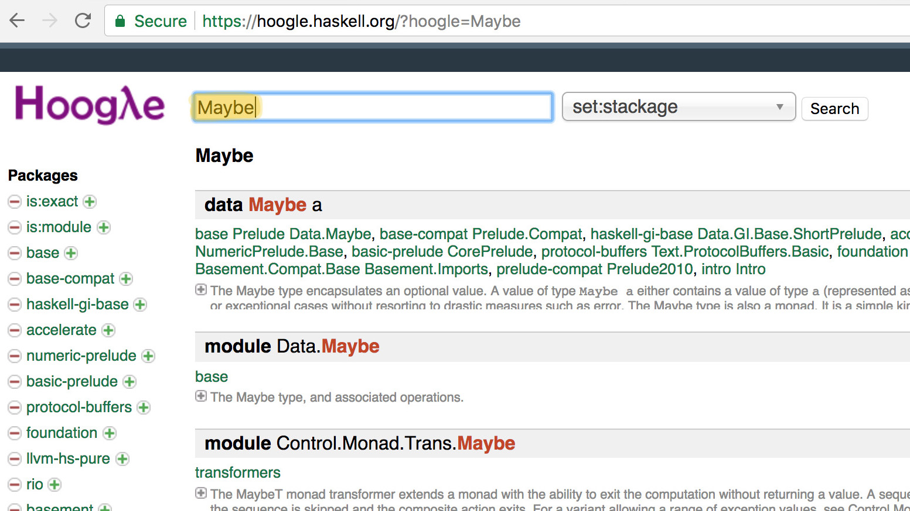
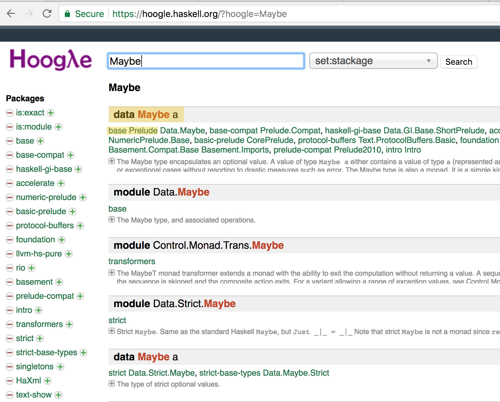
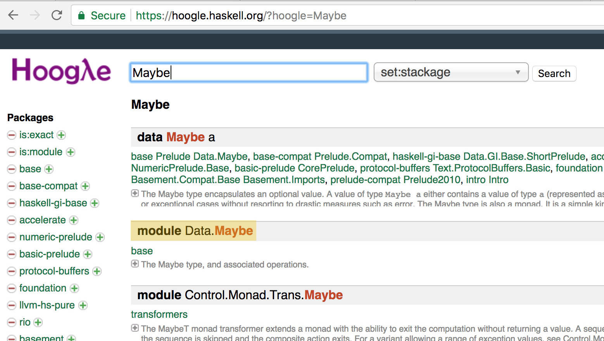
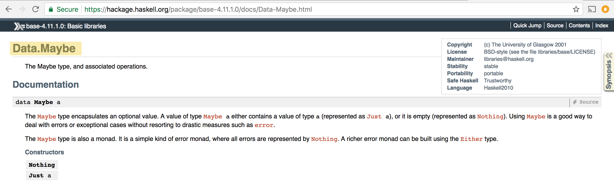
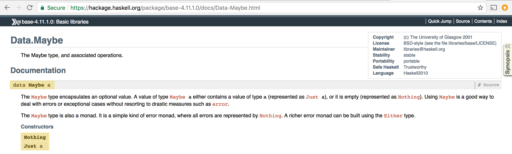
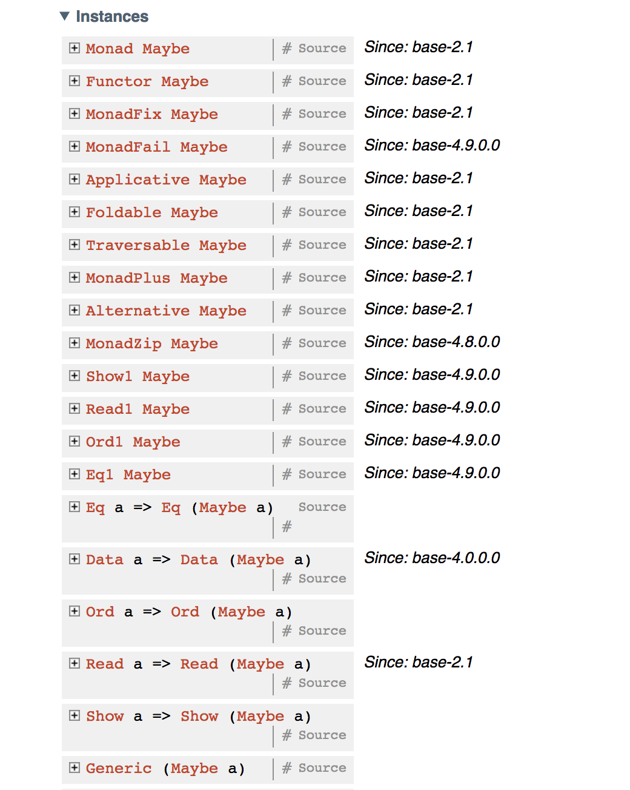
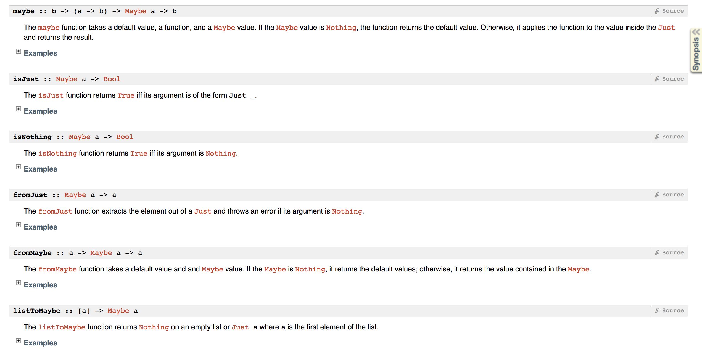

## Seriously, 
## the Haskell Type Checker is Your Friend: 
### a Pragmatic Approach to Working with GHC Errors

#### by J Haigh
#### @DebugSteven

Note:
Hi I’m J & I’m DebugSteven on Twitter if you’d like to follow me there. Today I'm going to talk about compiler errors by iterating over code examples & explaining why we get those errors & how to fix them. Over the last year I’ve become friends with the Glorious Glasgow Haskell Compilation System. For this presentation, I’ll be using GHC version 8.2.2.  

---


Note:
I started self studying Haskell after I completed my bachelor’s in Computer Science last year and I started a Haskell Book Club, here in Denver, in August. We completed the entire book 3 weeks ago. I struggled along with my fellow attendees to get my Haskell code working, which meant reading the error messages & trying to figure out what they mean. Working with the Haskell compiler errors can be difficult because Haskell is very different from most other programming languages people are used to. But if you practice, like we’ll do today, you’ll be able to do it! & I’m hoping by the end of this talk you’ll have a better understanding of GHC’s errors! 

Before we iterate through parse errors, definition errors, and type errors, I would like to talk about how errors manifest in our programs and how we respond when we see error messages.

---

#### Lovely Haskell Types & What They Look Like

```haskell
data Bool     = False | True
data Ordering = LT | EQ | GT
type String   = [Char]
data (,) a b  = (,) a b      -- definition for a tuple
data [] a     = [] | a : [a] -- definition for a list
-- (:) is the cons operator & appends an element onto a list

```

Note:
Most of the errors we encounter when we program are type errors. These type errors can appear in different ways. In dynamic languages for example, it's with runtimes errors. One of your most useful tools in that instance is peppering your program with print statements to figure out where the error is occuring & why. That's not really efficient though & there are several drawbacks. You can forget about your print statements later on. It's a slow feedback loop to figure out why your program isn't working. & it's subject to user error. In Haskell though, since we have types, like Bool, Int, String, & so on (& we aren’t putting undefined all over our program), we have greater confidence about what we will get out of our functions. The type signatures on our functions can help guide us to correct code & GHC will use the types to help point out where we’ve gone wrong too.

---


Note:
How do we typically respond when we see error messages though? I generally get frustrated. I just want to solve this program & have my program compile! The compiler is holding me back by preventing me from getting a program to run. I feel bad about getting this red highlighted text that says “hey you messed up here” and reading the error thinking about how Simon Peyton Jones is clearly disappointed in me for even getting this error. There’s this human aspect to reading the text. I’ve definitely read the error messages in the voice of my mentors and have felt like not knowing how to fix it immediately or without thinking is a failing on my part. It isn’t though. Consider this instead.

---


Note:
Functional programming is like snapping a bunch of functions together to get the result you’re looking for. This is like solving any sort of puzzle. Think about putting a jigsaw puzzle together. I’ve personally never gotten angry while putting a jigsaw puzzle together. It’s a pretty fun activity! It’s usually clear when two pieces don’t fix together. So you just move on in your puzzle solving to get the puzzle completed. The error is unspoken & obvious just upon inspection of the attempt to put the incorrect pieces together. You don’t usually just try to mash the pieces together & decide that solves your problem. That piece goes somewhere else! So now let’s rethink our feelings about the compiler.

---

#### GHC Referee

<span style="font-size: 0.5em;">Drawing by [Lee Baillie](https://twitter.com/_lbaillie)</span>

Note:
What if we had a puzzle referee, someone that told us our puzzle pieces aren’t fitting together? It isn’t always obvious looking at a program without compiling or running it that the code will or will not compile just fine. Haskell won’t let you mash functions and types that don’t go together because it is strongly and statically typed. We have greater confidence about what we will get out of functions because the GHC referee enforces the rules for putting together our program. So you will have to spend a little more time upfront to figure out how to fix the compiler errors, but, in my opinion, this is significantly better than spending your time fixing type errors after they’re discovered at runtime.
GHC will tell you where the error occurred, what rule you broke & what was expected by the compiler. This is super helpful. You can read that error & then fix your code to adhere to the rules! So let’s celebrate getting compiler errors. They’re saving us time from debugging errors later on!

---

#### Oh, The Kinds of Errors You'll See

- Parse Errors |
- Definition Errors |
- Type Errors |

Note:
Now that we've talked about how to feel better about seeing error messages let's talk about the kinds of errors that we will encounter while we try to get our program working.
ARROW
Parse errors occur when we have broken a formatting rule or some convention enforced by the compiler. Once we fix all of those we will get definition errors.
ARROW
Definition errors occur when we are calling that function that isn't defined by us in our scope or the function hasn't been imported from another module. Once we fit all our definition errors we'll get type errors.
ARROW
Type errors occur when we told the compiler we would do something via our types
and we haven't followed through in our function. After you fix all those errors you'll get your program to run! Let's take a look at parse errors first. 

---

#### Formatting Rules

```haskell
{-# LANGUAGE InstanceSigs #-}

import Control.Applicative

module Main where

mymain :: Int
mymain = print "hello world"

ruleBreaker :: Bool -> String
rulebraker b = 
  case b of
    True -> "yeah this code doesn't follow the rules"
      False -> "no broken rules here... " ++ truth
        where truth = "sorry, that isn't true"

let lie = 
"this code will compile fine"
```

Note:
Here we have a file that's breaking some formatting rules. 
Let's try compiling this & see what error messages we get.

+++

#### Error #1
``` 
[1 of 1] Compiling Main             ( format.hs, interpreted )

format.hs:5:1: error: parse error on input ‘module’
  |
5 | module Main where
  | ^^^^^^
Failed, no modules loaded.
```

Note:
Error. Parse error on input module.
This error occurred on line 5 of our file.
Let's go look at it.

+++

```haskell
{-# LANGUAGE InstanceSigs #-}

import Control.Applicative

module Main where

mymain :: Int
mymain = print "hello world"

ruleBreaker :: Bool -> String
rulebraker b = 
  case b of
    True -> "yeah this code doesn't follow the rules"
      False -> "no broken rules here... " ++ truth
        where truth = "sorry, that isn't true"

let lie = 
"this code will compile fine"
```
@[5]()

Note:
Here is the line that GHC is pointing us to in the error message.

+++

#### Top Of File

- Language pragmas are listed at the top of the file |
- Module name is declared above imports & code | 
- Imported modules listed before functions |

Note:
Language pragmas are listed
at the top of your file & I personally like
to have LANGUAGE in all uppercase because I like to yell as much as
possible in my code.
If you decide to give your file a module name,
it must be above the imported modules & functions, with a capitalized name.
Then you list modules you would like to import into your file. 
Imported modules must come before your functions. 

+++

#### Fix #1
```haskell
{-# LANGUAGE InstanceSigs #-}

module Main where

import Control.Applicative

-- This was our broken version
-- {-# LANGUAGE InstanceSigs #-}
-- 
-- import Control.Applicative
-- 
-- module Main where
```

+++

#### Order Matters
```haskell
{-# LANGUAGE InstanceSigs #-}

module Main where

import Control.Applicative

mymain :: Int
mymain = print "hello world"

ruleBreaker :: Bool -> String
rulebraker b = 
  case b of
    True -> "yeah this code doesn't follow the rules"
      False -> "no broken rules here... " ++ truth
      where truth = "sorry, that isn't true"

let lie = 
"this code will compile fine"
```

Note:
We can fix the error we got by moving module above 
the import in our file.
Let's reload to see our next error.

+++

#### Error #2
```
[1 of 1] Compiling Main             ( format.hs, interpreted )

format.hs:14:13: error: parse error on input ‘->’
   |
14 |       False -> "no broken rules here... " ++ truth
   |             ^^
Failed, no modules loaded.
```

Note:
Error. Parse error on input right arrow.
It shows us that the error in on line 14.
Let's go check out the code.

+++

```haskell
{-# LANGUAGE InstanceSigs #-}

module Main where

import Control.Applicative

mymain :: Int
mymain = print "hello world"

ruleBreaker :: Bool -> String
rulebraker b = 
  case b of
    True -> "yeah this code doesn't follow the rules"
      False -> "no broken rules here... " ++ truth
      where truth = "sorry, that isn't true"

let lie = 
"this code will compile fine"
```

@[13-18]()

Note: 
The error is on the line that starts with False, line 14.
But this entire code block has a similar problem.
So keep in mind the where block and the let for the rules we discuss next.

+++

#### Indentation Rules

- Code implementations start at least 1 space after the function name on the following line | 
```haskell
rulebraker b = 
    case b of
      True -> "yeah this code doesn't follow the rules"
      False -> "no broken rules here... " ++ truth
        where truth = "sorry, that isn't true"
```
@[1-2]()

Note:
My most common error is not having enough spaces between my function name 
and on the next line my implementation. You need to have the 
implementation 1 space over on the next line compared to the function name. 
This rule applies for let in expressions, case of expressions, guards, & where blocks!

+++ 

#### Indentation Rules

- New code blocks inside of other functions must be 1 space over to denote a new block |
```haskell
rulebraker b = 
    case b of
      True -> "yeah this code doesn't follow the rules"
      False -> "no broken rules here... " ++ truth
        where truth = "sorry, that isn't true"
```
@[2-3]()
Note:
When you start a new block you need to indent those expressions by at least 1 space.
Most people will use at least 2 spaces for readability. So here we can see that we need
be using a new code block because of the use of a case of expression. If you're using
a control structure and the following code will be on a new line that's a pretty good
indication you will need to indent your next section.

+++

#### Indentation Rules

- Code blocks must spatially align | 
```haskell
rulebraker b = 
    case b of
      True -> "yeah this code doesn't follow the rules"
      False -> "no broken rules here... " ++ truth
        where truth = "sorry, that isn't true"
```
@[3-4]()
Note:
Our `True` and `False` here are in the same block because they're both values of the
what our `case b of` can reduce down to. Because these expressions are in the same
block we need to make sure that they line up.

+++
#### Fix #2
```haskell
ruleBreaker :: Bool -> String
rulebraker b = 
  case b of
    True -> "yeah this code doesn't follow the rules"
    False -> "no broken rules here... " ++ truth
      where truth = "sorry, that isn't true"

let lie = 
     "this code will compile fine"
-- rulebraker b = 
--   case b of
--     True -> "yeah this code doesn't follow the rules"
--       False -> "no broken rules here... " ++ truth
--       where truth = "sorry, that isn't true"
-- 
-- let lie = 
-- "this code will compile fine"
```
+++

#### Indentation Fixed
```haskell
{-# LANGUAGE InstanceSigs #-}

module Main where

import Control.Applicative

mymain :: Int
mymain = print "hello world"

ruleBreaker :: Bool -> String
rulebraker b = 
  case b of
    True -> "yeah this code doesn't follow the rules"
    False -> "no broken rules here... " ++ truth
      where truth = "sorry, that isn't true"

let lie = 
     "this code will compile fine"
```
Note:
We fixed all our indentation problems by following
the rules we just talked about! Let's reload the
file & see where we're at with this file now.

+++

#### Error #3
```
[1 of 1] Compiling Main             ( format.hs, interpreted )

format.hs:19:1: error:
    parse error (possibly incorrect indentation or mismatched brackets)
Failed, no modules loaded.
```
Note:
Error. Parse error. Possibly incorrect indentation.
I know what you're thinking, "you said we fixed all our indentation!"
I promise I didn't lie.
This error occurs on line 19 & we don't have a line 19 in our file!
Let's go look at the end of the file instead.

+++

```haskell
{-# LANGUAGE InstanceSigs #-}

module Main where

import Control.Applicative

mymain :: Int
mymain = print "hello world"

ruleBreaker :: Bool -> String
rulebraker b = 
  case b of
    True -> "yeah this code doesn't follow the rules"
    False -> "no broken rules here... " ++ truth
      where truth = "sorry, that isn't true"

let lie = 
     "this code will compile fine"
```
@[17-18]()
Note:
We have the let expression highlighted here.
Why doesn't this work? Well, let's look at the rule.

+++

#### Functions are Top Level Declarations
`let` and `where` are meant to define functions
inside other functions within a local scope.


Just a function name at the top level will be fine!

Note:
We can't have anything but functions at the top
level of our file. You might be use to declaring
things that look like variables using an identifier
to distinguish it from functions, but in
Haskell everything is a function!

+++
#### Fix #3
```haskell
lie = 
  "this code will compile fine"

-- let lie = 
--      "this code will compile fine"
```

+++

#### Functions at The Top Level
```haskell
{-# LANGUAGE InstanceSigs #-}

module Main where

import Control.Applicative

mymain :: Int
mymain = print "hello world"

ruleBreaker :: Bool -> String
rulebraker b = 
  case b of
    True -> "yeah this code doesn't follow the rules"
    False -> "no broken rules here... " ++ truth
      where truth = 
             "sorry, that isn't true"

lie = 
 "this code will compile fine"
```

Note:
Let's just get rid of our let here & recompile.

+++

#### Error #4
```
[1 of 1] Compiling Main             ( format.hs, interpreted )

format.hs:10:1: error:
    The type signature for ‘ruleBreaker’ lacks an 
    accompanying binding
   |
10 | ruleBreaker :: Bool -> String
   | ^^^^^^^^^^^
Failed, no modules loaded.
```

Note:
Error. The type signature for ruleBreaker doesn't
have a function associated with it.
Let's go look at line 10 of our file.

+++

```haskell
{-# LANGUAGE InstanceSigs #-}

module Main where

import Control.Applicative

mymain :: Int
mymain = print "hello world"

ruleBreaker :: Bool -> String
rulebraker b = 
  case b of
    True -> "yeah this code doesn't follow the rules"
    False -> "no broken rules here... " ++ truth
      where truth = 
             "sorry, that isn't true"

lie = 
 "this code will compile fine"
```
@[10-11]()

Note:
The type signature & the function name are highlighted
here. You may notice that we have a typo
between the 2.

+++

#### If you have a type signature,
#### you must have a function implementation with it

+++
#### Fix #4
```haskell
ruleBreaker :: Bool -> String
ruleBreaker b = ... 

-- ruleBreaker :: Bool -> String
-- rulebraker b = ... 
```
+++

#### Type signatures for functions that exist
```haskell
{-# LANGUAGE InstanceSigs #-}

module Main where

import Control.Applicative

mymain :: Int
mymain = print "hello world"

ruleBreaker :: Bool -> String
ruleBreaker b = 
  case b of
    True -> "yeah this code doesn't follow the rules"
    False -> "no broken rules here... " ++ truth
      where truth = 
             "sorry, that isn't true"

lie = 
 "this code will compile fine"
```

Note:
Let's fix our typo & reload our code!

+++

#### Error #5
```
[1 of 1] Compiling Main             ( format.hs, interpreted )

format.hs:1:1: error:
    The IO action ‘main’ is not defined in module ‘Main’
  |
1 | module Main where
  | ^
Failed, no modules loaded.
``` 

Note:
The next error we get here says that the function main
isn't found in our module Main. Let's look at the code
and see if that's true.

+++

```haskell
{-# LANGUAGE InstanceSigs #-}

module Main where

import Control.Applicative

mymain :: Int
mymain = print "hello world"

ruleBreaker :: Bool -> String
ruleBreaker b = 
  case b of
    True -> "yeah this code doesn't follow the rules"
    False -> "no broken rules here... " ++ truth
      where truth = 
             "sorry, that isn't true"

lie = 
 "this code will compile fine"
```
@[3, 7-8]()

Note:
We have module Main on line 3 and we don't have a main
function anywhere in our file. Instead we have this function
called mymain.

+++

#### module Main where
`module Main` must have a `main` function

If you don't want a `main` function,
rename your module to anything other than `Main`.

Note:
So the rule we're breaking here is that if you use module Main
you have to have a function called main. If for whatever reason
you don't want to have a main function, just name your module
anything else (that starts with a capital letter).

+++
#### Fix #5
```haskell
module Main where

main :: Int
main = print "hello world"

-- module Main where
-- 
-- mymain :: Int
-- mymain = print "hello world"
```
+++

#### main for Main
```haskell
{-# LANGUAGE InstanceSigs #-}

module Main where

import Control.Applicative

main :: Int
main = print "hello world"

ruleBreaker :: Bool -> String
ruleBreaker b = 
  case b of
    True -> "yeah this code doesn't follow the rules"
    False -> "no broken rules here... " ++ truth
      where truth = 
             "sorry, that isn't true"

lie = 
 "this code will compile fine"
```

Note:
So we will rename mymain to main & reload our code
to see how we're doing.

+++
#### Error #6
```
[1 of 1] Compiling Main             ( format.hs, interpreted )

format.hs:8:1: error:
    • Couldn't match expected type ‘IO t0’ with actual type ‘Int’
    • In the expression: main
      When checking the type of the IO action ‘main’
   |
 8 | main = print "hello world"
   | ^

format.hs:8:8: error:
    • Couldn't match expected type ‘Int’ with actual type ‘IO ()’
    • In the expression: print "hello world"
      In an equation for ‘main’: main = print "hello world"
   |
 8 | main = print "hello world"
   |        ^^^^^^^^^^^^^^^^^^^
Failed, no modules loaded.
``` 

Note: 
Really this is 2 errors, but they go really well hand in hand.
The first error says we couldn't match the expected type of main,
which is IO of something, with the actual type, in the type signature, Int.
The compiler tells us on the 2nd error that we told them we would
give them an Int, but we are actually providing an IO of Unit.
It points to line 8, specifically at the expression: 
print "hello world". This is expected because the type of print
is a to IO of Unit where a has the constraint to have an instance of Show.
Let's go look at those lines.

+++

```haskell
{-# LANGUAGE InstanceSigs #-}

module Main where

import Control.Applicative

main :: Int
main = print "hello world"

ruleBreaker :: Bool -> String
ruleBreaker b = 
  case b of
    True -> "yeah this code doesn't follow the rules"
    False -> "no broken rules here... " ++ truth
      where truth = 
             "sorry, that isn't true"

lie = 
 "this code will compile fine"
```
@[7-8]()

Note:
We did in fact say we would return an Int here
& we aren't doing it.

+++

### main :: IO Type
`main` always returns `IO` of some type.
Usually main has a return value of `IO ()`

Note: In our main function we use print.
print has the type a to IO (). So we know we'll want to return IO ()

The rule to use function main is that main must return IO of some type.
It doesn't have to be IO (), but print has the return type of IO ().
Let's change our type signature of main to IO ().

+++

#### Fix #6
```haskell
main :: IO ()
main = print "hello world"

-- main :: Int
-- main = print "hello world"
```

+++

#### IO & main, together forever
```haskell
{-# LANGUAGE InstanceSigs #-}

module Main where

import Control.Applicative

main :: IO ()
main = print "hello world"

ruleBreaker :: Bool -> String
ruleBreaker b = 
  case b of
    True -> "yeah this code doesn't follow the rules"
    False -> "no broken rules here... " ++ truth
      where truth = 
             "sorry, that isn't true"

lie = 
 "this code will compile fine"
```

Note:
Here we are, main has the type IO of Unit, which reflects
the type that print "hello world" gives us. Let's reload.

+++

```
[1 of 1] Compiling Main             ( format.hs, interpreted )
Ok, one module loaded.
```

Note:
Sweet! Our file is properly formatted now!
There are no more errors in our code & this will run fine.
So... just one more thing. :)

---

#### Properly formatted file!
```haskell
{-# LANGUAGE InstanceSigs #-}

module Main where

import Control.Applicative

main :: IO ()
main = print "hello world"

ruleBreaker :: Bool -> String
ruleBreaker b = 
  case b of
    True -> "yeah this code doesn't follow the rules"
    False -> "no broken rules here... " ++ truth
      where truth = 
             "it's true!"

lie = 
 "this code won't compile fine"
```

Note:
Let's change the strings to reflect our code compiling haha.
You can flip back to look at the previous file & compare it
to our fixed file!

---

### Error Messages are Dishes Best Served Statically

Onto Definition & Type Errors! 

Note: 
Assume the code we're looking at is in a file & we're going to turn off the implicit prelude for our first example. I'll remind you to turn it back on afterwards.
We'll continue using the REPL to check ourselves as we go!

---

### Module or Define
Note:
The first error we will look at is when you need to define or bring in a module
to fix a function not being in scope.

+++

```haskell
λ> :t head
head :: [a] -> a
λ> head []
*** Exception: Prelude.head: empty list
```

Note:
First let's setup the problem we are going to look at.
Here is the type signature for `head`.
Given a list of some type a it will give you the first element of the list back.
However, if you give it an empty list it will blow up.
Let's try writing an implementation that protects us from
this exception.

+++

```
λ> :set -XNoImplicitPrelude
```
Note:
For this specific problem we are going to turn off the implicit prelude.
If you're following along with me in the REPL you won't get the same
errors as I do if you don't turn this off.
I'll remind you later to turn this extension back on.

+++

```haskell
safeHead :: [a] -> Maybe a
safeHead [] = Nothing
safeHead xs = Maybe head xs
```

Note:
Here we've defined a safe version of the head function.
Our `safeHead` function should handle the case of an empty list,
by returning `Nothing` instead of giving us a runtime exception.
If we have a list with at least one element we should get back
one value inside of our wrapper.

+++

```
ghci> :l safehead.hs
safehead.hs:1:20: error:
    Not in scope: type constructor or class ‘Maybe’
  |
1 | safeHead :: [a] -> Maybe a
  |                    ^^^^^
Failed, no modules loaded.
```
Note:
When we compile this we've get an error that the data
constructor `Maybe` isn't in scope.

+++

#### Using Hoogle


Note:
Data.Maybe is part of the prelude so if you haven't turned that off you won't
get an error for Maybe not being defined. 

Use can search for a particular type signature you're looking for a function to have
as well as searching for type constructors, data constructors, functions, & so on.
+++

#### Using Hoogle

Note:
This has information about Maybe, but this is the base library information.
This has a lot of stuff in it & so we want to look at something more specific.

+++

#### Using Hoogle

Note:
This is what we want to look at.

+++

#### Using Hoogle

Note:
Module name you'll want to use to import it.

+++

#### Using Hoogle

Note:
Type constructor & data constructors for Maybe

+++

#### Using Hoogle

Note:
Typeclass instances for Maybe

+++

#### Using Hoogle

Note:
Functions defined in the Data.Maybe module

+++

```haskell
import Data.Maybe

safeHead :: [a] -> Maybe a
safeHead [] = Nothing
safeHead xs = Maybe head xs
```
Note:
We can fix the error we get by importing the module that defines the type constructor`Maybe`. Let's reload and see if we have anymore definition errors.

+++

```
λ> :r
[1 of 1] Compiling Main             ( safehead.hs, interpreted )
above error elided for now...

safehead.hs:5:21: error: Variable not in scope: head
  |
5 | safeHead xs = Maybe head xs
  |                     ^^^^
Failed, no modules loaded.
```
Note:
This is another job for Hoogle. We haven't defined or imported the function head.
If we go look this one up the function is defined in Data.List.
So let's go ahead & import that.

+++

```haskell
import Data.Maybe
import Data.List

safeHead :: [a] -> Maybe a
safeHead [] = Nothing
safeHead xs = Maybe head xs
```
Note:
This will fix all our definition errors. Now let's talk about our remaining error
which will be a type error.

+++

### Data Constructors 
### & 
### Type Constructors

+++

```
λ> :r
[1 of 1] Compiling Main             ( safehead.hs, interpreted )

safehead.hs:6:15: error:
    • Data constructor not in scope:
        Maybe :: ([a0] -> a0) -> [a] -> Maybe a
    • Perhaps you meant variable ‘maybe’ (imported from Data.Maybe)
  |
6 | safeHead xs = Maybe head xs
  |               ^^^^^
Failed, no modules loaded.
```

+++

```
λ> import Data.Maybe
λ> :i Maybe
data Maybe a = Nothing | Just a         -- Defined in ‘GHC.Base’
```
Note:

Let's read this data declaration.
data, `Maybe a` is a type constructor that takes one type argument and
the possible values of `Maybe` are the data constructors `Nothing`
and `Just a` where `a` is some type. So in our function, if we gave `safeHead` a 
list of `Int`, the type of `a` would be an `Int`.

+++

```haskell
import Data.Maybe
import Data.List

safeHead :: [a] -> Maybe a
safeHead [] = Nothing
safeHead xs = Just head xs
```

+++

### Too Many Arguments

+++

```
λ> :r
[1 of 1] Compiling Main             ( safehead.hs, interpreted )

safehead.hs:6:15: error:
    • Couldn't match expected type ‘[a] -> Maybe a’
                  with actual type ‘Maybe ([a0] -> a0)’
    • The function ‘Just’ is applied to two arguments,
      but its type ‘([a0] -> a0) -> Maybe ([a0] -> a0)’ has only one
      In the expression: Just head xs
      In an equation for ‘safeHead’: safeHead xs = Just head xs
    • Relevant bindings include
        xs :: [a] (bound at safehead.hs:6:10)
        safeHead :: [a] -> Maybe a (bound at safehead.hs:5:1)
  |
6 | safeHead xs = Just head xs
  |               ^^^^^^^^^^^^
Failed, no modules loaded.
```

+++

```haskell
import Data.Maybe
import Data.List

safeHead :: [a] -> Maybe a
safeHead [] = Nothing
safeHead xs = Just (head xs)
```

+++

```
λ> :r
Ok, one module loaded.
```

---

### Another Example of Imports
Note:
Let's take a look at another function.
This example has the prelude imported.

+++

```
λ> :set -XImplicitPrelude
```
Note:
Here I would like to show you what happens when we have our Prelude
imported and what sort of suggestions we get in our errors.

+++

```haskell
module Sort where

sortWrapper xs = sort xs
```

Note:
We have a function called sortWrapper that takes one argument called
`xs` & we just want to sort it. `xs` is a list of some type that can be ordered.
Let's compile this.

+++

```
λ> :l sort.hs
[1 of 1] Compiling Sort             ( sort.hs, interpreted )

sort.hs:3:18: error:
    • Variable not in scope: sort :: t -> t1
    • Perhaps you meant ‘sqrt’ (imported from Prelude)
  |
3 | sortWrapper xs = sort xs
  |                  ^^^^
Failed, no modules loaded.
```
Note:
We get an error that says the function sort used on line 3 isn't in scope.
GHC even suggests the closest named function that we have in scope called
`sqrt`. But that isn't what we're looking for. Again, we can use Hoogle to figure
out what module this function is defined though!

+++

```haskell
module Sort where

import Data.List (sort)

sortWrapper xs = sort xs
```

Note:
We can see that `sort` is defined in `Data.List` & we can just import
that one function by listing it in parentheses after our module name.
This will work. :)

---

### Type Mismatch

+++

```haskell
data Nat = Zero | Succ Nat deriving (Eq, Show)
```
Note:
Here we have a type constructor `Nat` & we have
the data constructors `Zero` & `Succ` (Successor)
which takes 1 type argument `Nat`. This is a recursive
datatype to build numbers.
The deriving part at the end gives us Equality & the ability to print out the data constructors for free.

+++

### Peano Numbers

0 = Zero

1 = Succ Zero

2 = Succ (Succ Zero)

and so on.

Note:
The way to represent numbers that I just showed you is
called Peano numbers. A problem like this is useful to look
at because we get some practice to learn recursion & to build
recursive datatypes.

+++

```haskell
data Nat = Zero | Succ Nat deriving (Eq, Show)

integerToNat :: Integer -> Maybe Nat
integerToNat 0 = Just Zero
integerToNat 1 = Just (Succ Zero)
integerToNat i = if i < 0 
                 then Nothing 
                 else Just (Succ (integerToNat i-1))
```

Note:
We have a function called integer to natural. It takes an `Integer` and 
evaluates to a `Maybe Natural` because not all Integers are natural numbers.
The set of natural numbers starts at 0 & increases.
We have our base cases. We have a function that takes an argument i if our
previous cases don't match and runs through our if then else.

+++

```
Natural.hs:8:35: error:
    • Couldn't match expected type ‘Nat’ with actual type ‘Maybe Nat’
    • In the first argument of ‘Succ’, namely ‘(integerToNat i - 1)’
      In the first argument of ‘Just’, namely
        ‘(Succ (integerToNat i - 1))’
      In the expression: Just (Succ (integerToNat i - 1))
  |
8 |                  else Just (Succ (integerToNat i-1))
  |                                   ^^^^^^^^^^^^^^^^
```

+++

#### What Would We Expect That To Do?
```
> integerToNat 3
Just (Succ (Just (Succ (Just (Succ Zero))))
```
Note: 
Is that what we want though? Let's look at the info for Maybe
This was how I originally wrote the code when I was first attempting this
problem. Usually when I run into a type mismatch error now it's because
I haven't broken the problem down far enough.

+++

`data Maybe a = Nothing | Just a`

`data Nat = Zero | Succ Nat`

`Just (Succ (Succ (Succ Zero)))`

Note:
So let's break it down further.
We want to wrap the number in a Just if it belongs to the set of natural numbers.
We also want to actually build the number in Peano representation.


+++

```haskell
data Nat = Zero | Succ Nat deriving (Eq, Show)

integerToNat :: Integer -> Maybe Nat
integerToNat i =
  case i < 0 of
    True  -> Nothing 
    False -> (Just (f i))
    where f 0 = Zero
          f 1 = (Succ Zero)
          f n = (Succ (f(n-1)))
```

Note:
So in order to fix our type mismatch error & break our problem
down further I've created a function local to the integer to nat
function in our where that recursively builds the natural number
& then wraps that value in a `Just`.

---

### Not Enough Arguments

+++

#### EnumFromTo Ordering

```
λ> :t enumFromTo
enumFromTo :: Enum a => a -> a -> [a]

λ> :i Ordering 
data Ordering = LT | EQ | GT
...some other typeclass instances...
instance Enum Ordering -- Defined in ‘GHC.Enum’
```

Note:
We're going to a little problem setup before we
get into the code and talk about type errors here.
The enumerate from to function takes 2 arguments of type a
and those types have to have to be enumerable, which is
what that Enum a fat right arrow tells us.

For our problem we are going to use the type Ordering.
As we can see here, the type Ordering has an instance
of Enumerable already so we can use this type without
having to write an Enumerable typeclass instance.

+++

#### EnumFromTo Ordering

```
λ> enumFromTo LT GT
[LT,EQ,GT]
λ> enumFromTo GT LT
[]
λ> :t succ
succ :: Enum a => a -> a
λ> succ LT
EQ
```
Note:
So the function we are going to attempt to write
is enumFromTo for specifically Ordering.
Here's how that function works.

+++

#### EnumFromTo Ordering
```haskell
enumOrd :: Ordering -> Ordering -> [Ordering]
enumOrd b e = 
  if b <= e
  then b : bs
  else []
    where bs = enumOrd (succ b) 
```
Note:
Here is our attempt at the enumerate from to function for the Ordering type.

+++

```
eft.hs:10:12: error:
    • Couldn't match expected type ‘[Ordering]’
                  with actual type ‘Ordering -> [Ordering]’
    • Probable cause: ‘bs’ is applied to too few arguments
      In the second argument of ‘(:)’, namely ‘bs’
      In the expression: b : bs
      In the expression: if b <= e then b : bs else []
   |
10 |   then b : bs
   |            ^^
```

+++

```haskell
enumOrd :: Ordering -> Ordering -> [Ordering]
enumOrd b e = 
  if b <= e
  then b : bs
  else []
    where bs = enumOrd (succ b) 
```
@[4,6]()
Note:
Why would `bs` expect another argument? Well, what is bs defined to do?
bs is equal to enumOrd and the next value of b, but enumOrd takes 2 arguments!
Ahh! So we need to either have the give enumOrd another argument in the definition
for bs or we need to pass the argument to bs on line 4.

+++

```haskell
enumOrd :: Ordering -> Ordering -> [Ordering]
enumOrd b e = 
  if b <= e
  then b : bs
  else []
    where bs = enumOrd (succ b) e
```

+++

```haskell
enumOrd :: Ordering -> Ordering -> [Ordering]
enumOrd b e = 
  if b <= e
  then b : (bs e)
  else []
    where bs = enumOrd (succ b) 
```
Note:
When I first attempted this problem I felt pretty overwhelmed by
all the new things that were going on in this problem.
I wasn't familiar the Ordering type. It was strange how
the enumeration of the data constructors for the Ordering type worked.
I was still getting use to the cons operator to append an element
to a list and returning an empty list as the way to finish the recursive loop.
It was also my first time using the successor function.
That's a lot of new stuff! So I didn't really focus on the logic of the function
while I was trying to figure out how all these pieces fit together.

+++

```
λ> enumOrd GT GT
[GT*** Exception: Prelude.Enum.Ordering.succ: bad argument
```
Note:
You have may noticed that we don't handle all the cases.
If you didn't notice, neither did I when I first wrote this!
The types didn't save us from this runtime error! We still have to be careful
about writing code that can blow up when we run it. 

+++

```haskell
enumOrd :: Ordering -> Ordering -> [Ordering]
enumOrd b e  
    | b < e = b : bs
    | b > e = []
    | b == e = [e] 
      where bs = enumOrd (succ b) e
```

Note:
So after my first attempt & understanding a little bit better how the
types and functions were working together I was able to focus more on the logic.
I found that the logic was easier to represent using a guard & writing
out all the possibilities I would need to cover for this problem.
I ended up writing this with a guard & you may find that using
particular control structures for particular problems
may make more sense to you and be more readable. I find that when
my code is more readable it's easier to understand my type errors too.

---

## Believe In Yourself

Note:
We’ve talked about how to think and feel a little better about error messages as well as how to fix a bunch of them, but there’s one thing we haven’t covered. 
Getting good at debugging in any new language takes time. For Haskell specifically, 
I think it can be overwhelming as a beginner because there is so much new stuff you feel 
you need to learn to be good at it. I’ve gotten significantly better over the last year 
because I practiced & I've written a lot of code. You don’t necessarily need to know exactly what a function does to use it. You just need to find what fits & solves your problem & you'll learn along the way. 
If you read the compiler errors like we’ve done today 
and you use Hoogle to look up the type signature you need, 
you can play around with it and get it and you will get better at fixing type errors.

---

## Thank You!

http://tiny.cc/HBCSignup 

Note: If you're interested in learning Haskell by working through
Haskell Programming from first prinicples by Chris Allen & Julie Moronuki
I'm running through this book to the Monad chapter with Pyrrh starting on
June 18th. The signup & details can be found at this link! Thank you! 
